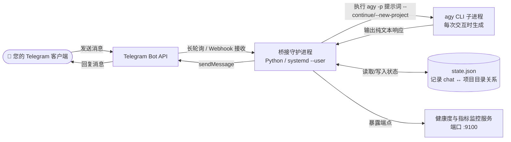

# 🤖 antigravity-telegram-bridge (Antigravity Telegram 桥接器)

[](https://www.python.org/downloads/)
[](./tests)
[](./LICENSE)
[](https://systemd.io/)
[](https://antigravity.google)

通过 Telegram 与 [Antigravity CLI](https://antigravity.google) (`agy`) 进行对话。

本仓库 Fork 自 `hah23255/kimi-to-im`，并经过修改以驱动 Google 的 `agy` CLI（用以替代已停止维护的 `gemini` CLI）。每个 Telegram 会话（Chat）都拥有独立的 `agy` 项目/工作目录，使得会话状态在消息交互间得以持久化，并保证不同用户/会话之间的绝对隔离。

**自托管 · 单用户 · Python · systemd 监控 · 支持 Webhook**

[English](#english) · [Български](#български) · [中文说明](#中文说明)

---

## 中文说明

### 项目简介
这是一个为 Google Antigravity CLI (`agy`) 编写的 Telegram 桥接守护进程（Daemon），让您能够直接在 Telegram 聊天窗口中，以持久、隔离的方式控制 AI 代理对您的代码库进行远程开发与修改。项目版本：`0.2.0`。

### 功能特性
| 功能特性 | 状态 |
|---|---|
| Telegram ↔ `agy` 消息双向传递 | ✅ |
| 基于单会话的项目隔离 (`--new-project` / `--continue`) | ✅ |
| 内联键盘控制面板 (`/settings`, `/model`, `/mode`) | ✅ |
| 支持图片/文档上传，并附带可配置的安全路由过滤 | ✅ |
| 可配置的文件类型白名单（对各类文件设置通过/警告/暂存/阻止等规则）| ✅ |
| 基于滑动窗口的单用户限流机制（Rate Limiting） | ✅ |
| 内存健康门限与自动重启机制 | ✅ |
| 僵尸子进程自动清理与垃圾回收 | ✅ |
| 多用户先进先出 (FIFO) 排队机制 | ✅ |
| 支持带 HMAC 签名校验的 Webhook 模式 | ✅ |
| 具备健康度检查端点 (`/health`) 和 Prometheus 指标监控 (`/metrics`) | ✅ |
| 进行了安全加固的 `systemd --user` 系统服务支持 | ✅ |
| 配套的 `agy` 插件工具（支持 `bridge start/stop/status/logs/setup`）| ✅ |
| 包含 105 个单元测试，100% 通过率 | ✅ |

### 快速开始

**运行前提条件**：
* 操作系统：带有 `systemd --user` 支持的 Linux 系统（如 Ubuntu/Debian 等）。
* Python 环境：Python 3.11 或更高版本。
* 包管理工具：安装有 `uv` 工具。
* 核心依赖：在系统环境变量 `PATH` 中可调用的 `agy` 命令行工具。
* 账号认证：确保已在本地终端成功运行并登录过一次 `agy`（完成浏览器 OAuth 授权流程）。
* 准备参数：
  * 从 [@BotFather](https://t.me/BotFather) 获取的 Telegram Bot Token。
  * 从 [@userinfobot](https://t.me/userinfobot) 获取的您的个人 Telegram User ID。

**安装步骤**：

1. **克隆仓库**：
   ```bash
   git clone https://github.com/hah23255/agy-to-im.git \
     ~/.gemini/extensions/antigravity-telegram-bridge
   cd ~/.gemini/extensions/antigravity-telegram-bridge
   ```

2. **安装并配置项目**：
   ```bash
   # 执行安装脚本
   ./install.sh

   # 复制并配置配置文件
   cp config.example.json config.json
   chmod 600 config.json

   # 使用编辑器打开 config.json，填入您的 bot_token 和 allowed_user_ids
   $EDITOR config.json
   ```

3. **启动后台桥接服务**：
   ```bash
   systemctl --user start antigravity-telegram-bridge.service
   ```

> 📖 **更多文档**：更详细的步骤请参阅项目中的 `docs/deployment.md`；日常维护和操作说明请参阅 `docs/operations.md`。

### 配置文件参考

配置文件 `config.json` 的基本结构如下：
```json
{
  "telegram": {
    "bot_token": "1234567890:...",
    "allowed_user_ids": [123456789],
    "allowed_chat_ids": []
  },
  "agy": {
    "chats_root": "",
    "default_workdir": "",
    "model": "",
    "mode": "code"
  }
}
```

### 可用文本命令
* `/start` - 显示欢迎信息。
* `/help` - 显示使用帮助说明。
* `/status` 或 `/info` - 查看当前会话状态摘要。
* `/settings` - 调出内联控制面板（切换模型、更改模式、重置等）。
* `/reset` - 为当前聊天会话重置并开启一个全新的 `agy` 项目。
* `/image on|off` - 启用或禁用照片图片分析。
* `/files` - 列出收件箱（Inbox）中的文件。
* `/files clean` - 清空收件箱中的所有文件。
* `/queue` - 查看多用户排队队列状态。

### 系统架构图



### 常见故障处理手册

| 故障现象 / 错误信息 | 根本原因分析 | 解决与缓解措施 |
| :--- | :--- | :--- |
| `ModuleNotFoundError: No module named 'httpx'` | 桥接服务启动时使用了系统全局的 Python 解释器，而没有使用虚拟环境中的 `.venv`。 | 确保 systemd 服务单元或启动脚本运行在项目自身的虚拟环境中（使用 `./.venv/bin/python` 路径启动）。 |
| Unauthorized / Token Rejected | 填入的 Telegram Bot API Token 错误、已过期或已被官方停用。 | 检查并确保 `config.json` 中配置的 token 绝对正确且来自官方 @BotFather。 |
| Access Denied (用户白名单限制) | 发送消息的 Telegram 账号 ID 不在配置的白名单 `allowed_user_ids` 数组中。 | 通过 userinfobot 获取您正确的 Telegram ID，添加至 `config.json` 的数组中，并重启守护进程。 |
| `systemd --user` 服务启动失败 | 当前系统用户的 systemd 用户实例无法正常启动后台服务（常见于系统未开启 Linger 保持）。 | 以 root 用户或当前用户身份运行 `loginctl enable-linger <用户名>`，使该用户在未登入状态下也能保持后台服务运行。 |
